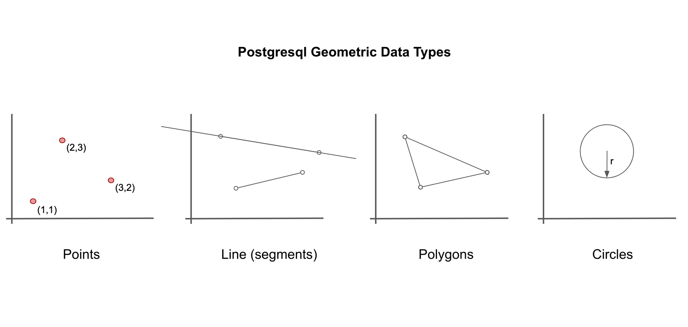

From **Peter Gleeson**  
https://www.freecodecamp.org/news/postgresql-tricks/  
NOVEMBER 18, 2019

---

Points are the basic building block for all geometric data types in PostgreSQL. They are represented as (x, y) coordinates.

```PGSQL
SELECT 
  POINT(0,0) AS "origin",
  POINT(1,1) AS "point";
 ```
 
You can also define lines. These can either be infinite lines (specified by giving any two points on the line). Or, they can be line segments (specified by giving the 'start' and 'end' points of the line).

```PGSQL
SELECT
  LINE '((0,0),(1,1))' AS "line",
  LSEG '((2,2),(3,3))' AS "line_segment";
```

Polygons are defined by a longer series of points.

```PGSQL
SELECT
  POLYGON '((0,0),(1,1),(0,2))' AS "triangle",
  POLYGON '((0,0),(0,1),(1,1),(1,0))' AS "square",
  POLYGON '((0,0),(0,1),(2,1),(2,0))' AS "rectangle";
 ```
 
Circles are defined by a central point and a radius.

SELECT
  CIRCLE '((0,0),1)' as "small_circle",
  CIRCLE '((0,0),5)' as "big_circle";
 ```
There are many functions and operators that can be applied to geometric data in PostgreSQL.

You can:

Check if two lines are parallel with the ?|| operator:
```PGSQL
SELECT
  LINE '((0,0),(1,1))' ?|| LINE '((2,3),(3,4))';
 ```
Find the distance between two objects with the <-> operator:
```PGSQL
SELECT 
  POINT(0,0) <-> POINT(1,1);
 ```
Check if two shapes overlap at any point with the && operator:
```PGSQL
SELECT
  CIRCLE '((0,0),1)' &&  CIRCLE '((1,1),1)';
 ```
Translate (shift position) a shape using the + operator:
```PGSQL
SELECT
  POLYGON '((0,0),(1,2),(1,1))' + POINT(0,3);
 ```
And lots more besides - check out the [documentation](https://www.postgresql.org/docs/12/functions-geometry.html) for more detail!
