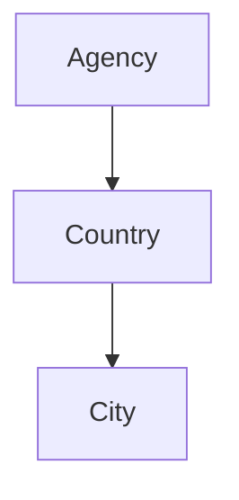

# string_agg

**string_agg()** combines non-null values into one string, separated by the delimiter character that you specify in the second parameter. 
For example, in the Sakila database there's a city and a country table. If you want to show the available cities per country in one line, separated by commas:

country               |             cities             
----------------------|--------------------------------
 Thailand             | Nakhon Sawan, Pak Kret, Songkhla

This is a table for a travelling agency


```PGSQL
CREATE TABLE agency_country
(id SERIAL, country VARCHAR);

CREATE TABLE agency_city
(id SERIAL, 
 country integer REFERENCES agency_country(id),
 city VARCHAR);

select
  country,
  string_agg(city, ',') as cities
from agency_coutry as country
join agency_city as city using (country_id)
group by country
limit 4;
```

country                |             cities             
-----------------------|--------------------------------
| Thailand             | Songkhla,Nakhon Sawan,Pak Kret
| Faroe Islands        | Trshavn
| Bangladesh           | Jamalpur,Tangail,Dhaka
| United States        | Springfield, Springfield
 
Note that PostgreSQL does not assume a default delimiter. You need to specify it as the second parameter. Also note that like other aggregate functions, you must use the group by clause with string_agg().

Removing duplicates in our output string
Notice that in our results, there are multiple cities in the United States named "Springfield". If you want to omit any duplicates, simply add distinct in the first parameter:

```PGSQL
select
  country,
  string_agg(distinct city, ',') as cities
from country
join city using (country_id)
group by country
limit 4;
```

country               |             cities             
----------------------|--------------------------------
 Thailand             | Songkhla,Nakhon Sawan,Pak Kret
 Faroe Islands        | Trshavn
 Bangladesh           | Jamalpur,Tangail,Dhaka
 United States        | Springfield
 
Ordering the contents within the output string
Perhaps you also want the output of the `string_agg()` function to be ordered alphabetically. You can specify the order using order by after the second parameter:

```PGSQL
select
  country,
  string_agg(distinct city, ',' order by city asc) as cities
from country
join city using (country_id)
group by country
limit 4;
```

country               |             cities             
----------------------|--------------------------------
 Thailand             | Nakhon Sawan,Pak Kret,Songkhla
 Faroe Islands        | Trshavn
 Bangladesh           | Dhaka,Jamalpur,Tangail
 United States        | Springfield
 
This can be helpful for particular long outputs, but the order by clause is optional.
